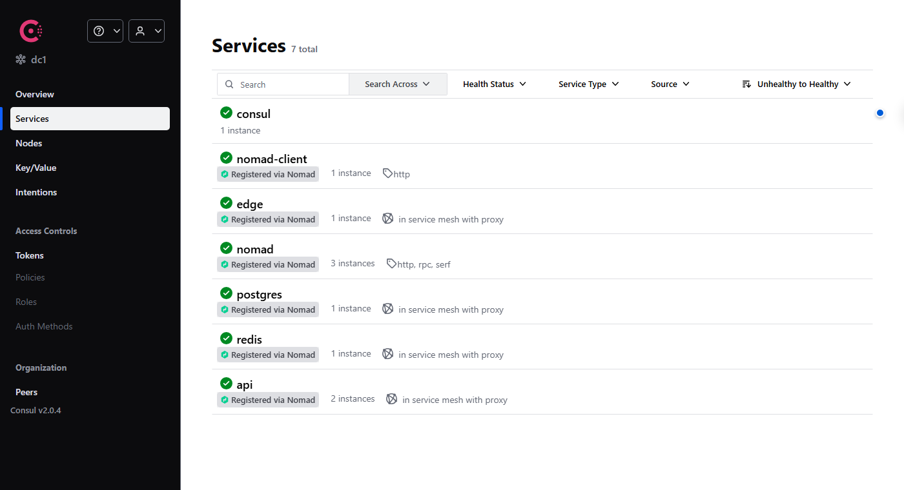
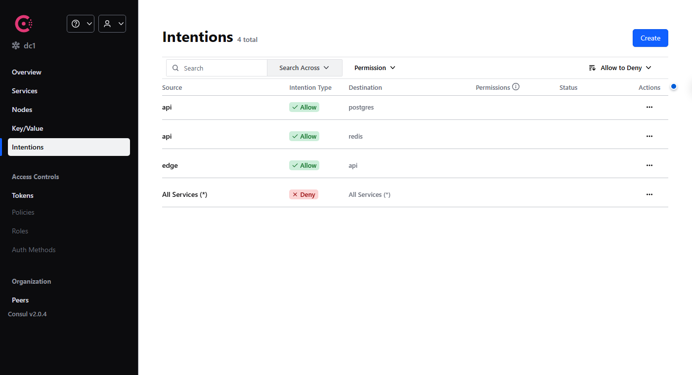

# items-api on Nomad + Consul Connect

A three-tier app (FastAPI → Redis → Postgres) scheduled by Nomad, where every hop between
services is an mTLS connection through Consul Connect sidecars, the data tier has no
reachable port outside the mesh, and the mesh is deny-by-default.

```
curl :8000 ──► edge (nginx) ──mesh──► api ×2 (FastAPI) ──mesh──► redis 8.8
                                                     └──mesh──► postgres 18 (host volume)
```

Full diagram and request walkthrough: [docs/architecture.md](docs/architecture.md).
Why things are the way they are: [docs/adr/](docs/adr/README.md).

## What is in here

| Path | What |
|---|---|
| `jobs/*.nomad.hcl` | `postgres`, `redis`, `api` (count = 2, rolling updates), `edge` (ingress) |
| `consul/config-entries/` | service protocols + intentions: deny-all, allow `edge→api`, `api→redis`, `api→postgres` |
| `consul/chaos/` | the deny used by `make chaos` |
| `api/` | FastAPI app (read-through cache, invalidation, fail-open) + Dockerfile |
| `nomad/client.hcl` | host volume definition for Postgres |
| `scripts/` | setup, start/stop, KV seed, intentions, verify, chaos |
| `docs/` | architecture, ADRs, screenshots |
| `nomad-in-docker/` | part one of the exercise (Nomad dev agent in a container), kept for reference |

## Versions

Pinned to the latest releases available on **2026-10-07**.

| Component | Version | Source |
|---|---|---|
| Nomad | 2.0.7 | releases.hashicorp.com (2026-09-18) |
| Consul | 2.0.4 | releases.hashicorp.com (2026-09-10) |
| CNI plugins | v1.9.1 | github.com/containernetworking/plugins (2026-03-16) |
| Envoy (sidecars, pulled by Nomad) | 1.38.x | Consul 2.0.x compatibility matrix |
| Docker Engine (inside the WSL distro) | 29.8.2 | docs.docker.com/engine/release-notes (2026-09-30) |
| postgres | `18-alpine` | Docker Hub (2026-09-21) |
| redis | `8.8-alpine` | Docker Hub (2026-09-25) |
| nginx | `1.31-alpine` | Docker Hub (2026-09-29) |
| python | `3.13-slim` | Docker Hub |
| fastapi / uvicorn / asyncpg / redis-py | 0.142.2 / 0.54.0 / 0.32.0 / 8.1.0 | PyPI |

## Prerequisites (Windows 11)

- A WSL2 Ubuntu distro with systemd enabled. Docker Engine is installed **inside the
  distro** by `make setup`; it is not Docker Desktop.
- If Docker Desktop is installed, turn its WSL integration **off** for this distro
  (Settings → Resources → WSL integration). Otherwise Desktop's stub shadows the real
  `docker` and Nomad talks to a daemon in another distro (see
  [ADR 0001](docs/adr/0001-run-agents-natively-in-wsl2.md)).

```powershell
wsl --install -d Ubuntu-24.04 --no-launch
wsl -d Ubuntu-24.04 -u root
```

Keep the repo in the distro's own filesystem, not under `/mnt/c`: it is faster and avoids
NTFS permission quirks with Docker build contexts and the Postgres volume.

```bash
# inside Ubuntu, as root
git clone <this repo> ~/Assignment_Day0 && cd ~/Assignment_Day0
code .      # VS Code opens via the WSL extension; its terminal is this shell
```

Everything below runs **inside that Ubuntu shell as root**. Root is required:
`nomad agent -dev-connect` creates network namespaces. Do not run `docker build` or
`nomad job run` from PowerShell: that reaches a different daemon (Docker Desktop's, if it
is running), and Nomad cannot see images built there.

## Bring-up, step by step

```bash
make setup        # once: Docker Engine, HashiCorp apt repo, nomad, consul, CNI plugins, bridge sysctls
make up           # consul agent -dev -ui   +   nomad agent -dev-connect -config=nomad/client.hcl
make kv           # seed Consul KV: app/db/{user,password,name}, app/cache/ttl
make build        # docker build -t local/api:dev ./api
make deploy       # nomad job run jobs/{postgres,redis,api,edge}.nomad.hcl
make intentions   # consul config write consul/config-entries/*.hcl  (deny-by-default)
make verify       # the curl walkthrough below
```

or just `make all`. UIs: Consul <http://localhost:8500>, Nomad <http://localhost:4646>.

Sanity checks after `make up`:

```bash
nomad node status      # one node, Status = ready
consul members         # one server, alive
```

## Verify

```bash
$ curl -s -X POST "localhost:8000/items?name=hello"
{"id":1,"name":"hello","source":"db"}

$ curl -s -i localhost:8000/items/1 | grep -iE 'x-cache|x-instance|source'
x-cache: MISS
x-instance: 3f1c9a2b
{"id":1,"name":"hello","source":"db"}

$ curl -s -i localhost:8000/items/1 | grep -iE 'x-cache|x-instance|source'
x-cache: HIT
x-instance: 9d0e77c4          # the other api allocation answered: Envoy round-robin
{"id":1,"name":"hello","source":"cache"}

$ curl -s -i -X PUT "localhost:8000/items/1?name=hello-v2" | grep -i x-cache
x-cache: INVALIDATED
```

`make verify` runs this sequence and finishes with ten reads whose `X-Instance` values
alternate between the two API allocations.

Then look at:

- Consul UI → Services: `api`, `edge`, `postgres`, `redis`, each with a `-sidecar-proxy`
  and green checks.
- Consul UI → Intentions: one `* → *` deny and three allows.
- Nomad UI → `api` has two allocations, each with tasks `api` and `connect-proxy-api`.





## Break it on purpose

```bash
make chaos
```

1. Writes a `api → redis: deny` intention.
2. Waits for the API's pooled Redis connections to be closed (Redis `--timeout 10`;
   intentions apply to *new* connections).
3. `GET /items/1` still returns **200**, now with `X-Cache: BYPASS` and `source: db`
   (fail-open, see [ADR 0002](docs/adr/0002-read-through-cache-with-invalidation-and-fail-open.md)).
   `GET /ready` reports `"redis": false, "postgres": true`.
4. Restores the allow; reads are `HIT` again straight away, because the cached entry
   outlived the outage (`BYPASS` reads never touch Redis, so nothing was invalidated).
   If the TTL expired meanwhile you see one `MISS` first.

The API never crashed and never returned an error; the mesh refused the connection at
Redis's sidecar and the application degraded exactly as designed.

## Stretch goals

| Goal | Where |
|---|---|
| Explicit intentions, deny-by-default | `consul/config-entries/90-intentions-default-deny.hcl` + `2x-*.hcl` |
| `count = 2` on the API | `jobs/api.nomad.hcl`; load-balanced by the edge sidecar ([ADR 0004](docs/adr/0004-edge-ingress-through-the-mesh.md)); watch `X-Instance` |
| Persistent Postgres volume | `nomad/client.hcl` `host_volume` + `volume`/`volume_mount` in `jobs/postgres.nomad.hcl`; survives `make down` |
| `DATABASE_URL` from Consul KV | `template {}` in `jobs/api.nomad.hcl`; `consul kv put app/cache/ttl 5` triggers a rolling restart |

## Handy commands

```bash
make status                         # jobs, services, intentions
make logs                           # api logs from every allocation
nomad alloc exec -task api <id> sh  # shell inside an api container
nomad alloc logs <id> connect-proxy-api   # the Envoy sidecar's logs
consul intention check api redis    # "Allowed" / "Denied"
make down                           # stop everything; Postgres data stays in /opt/nomad/volumes
```

## Troubleshooting

| Symptom | Cause |
|---|---|
| `api` allocation stuck in `pending`, task log says "Missing: kv.block(app/db/password)" | KV not seeded: `make kv` |
| `localhost:8000` refuses connections right after `make down` + `make up`, `edge` alloc is "running" | stale CNI NAT rules and pause containers from the previous run (agent was killed mid-teardown). `make down` waits for allocations and flushes CNI chains; run it again, then `make up` |
| `edge` placement fails: "port 8000 already in use" | something else on the host owns 8000 (e.g. the part-one Nomad container, or a previous `edge`) |
| `edge` answers `503 upstream connect error` while every check except `edge` passes | the API's sidecar forwards to the wrong local port. `service.port` must be the numeric in-namespace port, not a port label; see [ADR 0004](docs/adr/0004-edge-ingress-through-the-mesh.md) |
| sidecars crash-loop with "consul: command not found" | Nomad needs the `consul` binary on `$PATH` to bootstrap Envoy; `make setup` installs it |
| `docker` prints "could not be found in this WSL 2 distro" | that is Docker Desktop's stub on `$PATH`; `make setup` installs the real engine, and `systemctl start docker` starts it |
| `make setup` exits with "systemd enabled in /etc/wsl.conf" | run `wsl --shutdown` in PowerShell, reopen the distro, run `make setup` again |
| image `local/api:dev` not found by Nomad | it was built from PowerShell against Docker Desktop; rebuild with `make build` inside Ubuntu and check `docker images` there |
| allocations have no network / CNI errors | `ls /opt/cni/bin` should list `bridge firewall portmap ...`; `sysctl net.bridge.bridge-nf-call-iptables` must be 1 (`make up` sets it) |

## What I would do next

Not done, on purpose, to keep the scope honest:

- Request coalescing (single-flight) on cache misses so N concurrent misses for one key
  cost one DB query. Matters with `count = 2`; left out because it is the first thing that
  would need a real load test to justify.
- Vault for `app/db/password` (same `template {}` shape, different source).
- Prometheus `/metrics` on the API and Envoy's L7 stats, scraped into the Consul UI topology
  view.
- Alembic migrations as a `prestart` task once there is a second table.
