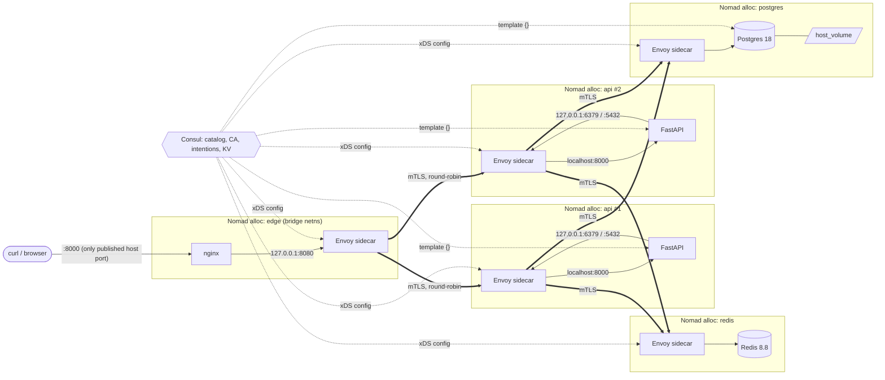

# Architecture

Four Nomad jobs, one Consul service mesh, zero plaintext hops.

Thick arrows are the only cross-allocation traffic, and every one of them is an mTLS
connection between two Envoys whose identities Consul issued. Thin arrows never leave a
network namespace.

## Request path for `GET /items/1`

1. `curl localhost:8000` hits the **edge** allocation's static port, mapped to nginx `:80`.
2. nginx proxies to `127.0.0.1:8080`, which is its sidecar's *upstream listener* for `api`.
3. Envoy picks a healthy `api` instance (round-robin), opens an mTLS connection to that
   instance's sidecar, and presents the `edge` identity.
4. The api sidecar checks the intention `edge -> api: allow`, then forwards to
   `localhost:8000` where uvicorn listens.
5. FastAPI does `GET item:v1:1` against `127.0.0.1:6379` -- its own sidecar's upstream for
   `redis`. Same dance: mTLS to redis's sidecar, intention `api -> redis: allow`, forward
   to redis `:6379`.
6. On a miss it does the same towards `127.0.0.1:5432` -> postgres, then writes the row
   back to Redis with the TTL, and answers with `X-Cache: MISS` and `source: db`.

## What each layer is responsible for

| Concern | Owner | Where |
|---|---|---|
| Who may talk to whom | Consul intentions | `consul/config-entries/*.hcl` |
| Encryption + identity | Consul CA via Envoy sidecars | implicit in `connect { sidecar_service {} }` |
| Service discovery / load-balancing | Envoy upstream clusters fed by Consul catalog | `upstreams {}` blocks |
| Health | Nomad-registered Consul checks | `check {}` blocks |
| Config and secrets | Consul KV rendered by consul-template | `template {}` blocks, `scripts/seed-kv.sh` |
| Scheduling, restarts, rolling updates | Nomad | `jobs/*.nomad.hcl` |
| Persistence | Nomad host volume | `nomad/client.hcl`, `jobs/postgres.nomad.hcl` |
| Cache policy (read-through, TTL, invalidation, fail-open) | the application | `api/app/cache.py`, `api/app/main.py` |

## Why there is no direct path to Redis or Postgres

Neither job publishes a host port. From the host, `redis-cli -p 6379` fails, because the
only listener on that port lives inside the redis allocation's network namespace, behind a
sidecar that requires a client certificate the mesh issued to `api`. The attack surface
of the data tier is exactly one mTLS listener per service, and the policy that governs it
is four small HCL files.

See the ADRs in [`docs/adr/`](adr/) for the reasoning behind each choice.
